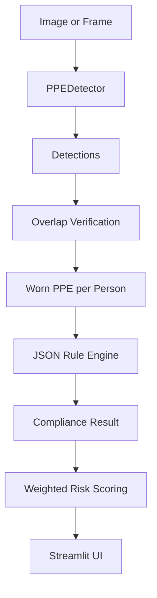

# Context-Aware PPE Compliance & Risk Assessment

Streamlit application and Python package for detecting PPE, verifying whether it is worn by a specific person, and reporting the expected scene risk from the trained YOLO model.

## What It Does

- Runs PPE detection through a fine-tuned Ultralytics YOLO model.
- Uses person-relative overlap regions to decide whether PPE is worn, rather than merely present.
- Loads construction, laboratory, and welding requirements from JSON.
- Scores missing required PPE with normalized 0-100 risk severity.
- Shows required PPE beside detected/worn PPE in a Streamlit UI.
- Supports image batches and sampled video frames.
- Reports missing PPE, expected risk, and the most important warning for the selected scene.

## Current Dataset

The workspace already contains the merged YOLO dataset at `data/processed/`.

| Split | Images |
|---|---:|
| train | 8202 |
| valid | 913 |
| test | 435 |

Canonical classes:

```text
0 person
1 helmet
2 safety_vest
3 gloves
4 safety_boots
5 safety_goggles
6 face_mask
7 lab_coat
```

Raw sources:

- `data/GENERAL_DIR/`: construction PPE dataset with person, helmet, vest, gloves, boots, and related synonym/negative classes.
- `data/LABCOAT_DIR/`: lab coat dataset with lab coat, goggles, gloves, mask, and related synonym/negative classes.

The merge logic is in `scripts/merge_datasets.py`. It preserves the original Roboflow train/valid/test splits and remaps both datasets into the unified 8-class schema.

Known data limitations to mention in demos/interviews:

- The lab coat source does not include `person` boxes, so lab images can contain unlabeled people.
- `safety_goggles` and `face_mask` are mostly learned from lab-context images and may under-generalize to welding/construction scenes.
- `hat -> helmet` and `glasses -> safety_goggles` are judgment-call mappings. Use `scripts/inspect_dataset.py` to spot-check samples before trusting a full training run.

## Setup

```powershell
python -m venv .venv
.\.venv\Scripts\Activate.ps1
pip install -r requirements.txt
```

## Train The Detector

```powershell
python train.py --data data/processed/data.yaml --base-model yolo11s.pt
```

The script uses the Ultralytics Python API, seeds training with `seed=42`, validates the final weights, and copies the best checkpoint to:

```text
models/weights/ppe_best.pt
```

Optional ONNX export:

```powershell
python train.py --export-onnx
```

## Run The App

```powershell
streamlit run app/streamlit_app.py
```

The app opens with a scene selector and three input sections:

- `Image`: upload a single image.
- `Webcam`: capture an image from the webcam.
- `Video`: upload a video and review sampled frames.

It uses `models/weights/ppe_best.pt` directly.

## Dataset QA

Spot-check the raw general dataset `hat -> helmet` mapping:

```powershell
python scripts/inspect_dataset.py --dataset-dir data/GENERAL_DIR --data-yaml data/GENERAL_DIR/data.yaml --class-id 8 --limit 20
```

Spot-check the raw general dataset `glasses -> safety_goggles` mapping:

```powershell
python scripts/inspect_dataset.py --dataset-dir data/GENERAL_DIR --data-yaml data/GENERAL_DIR/data.yaml --class-id 6 --limit 20
```

Annotated outputs are written to `reports/inspection/`.

## Architecture



Main modules:

- `src/detection/detector.py`: Ultralytics wrapper plus label-backed demo detector.
- `src/ppe_verification/overlap_rules.py`: pure region-overlap logic.
- `src/rule_engine/rule_engine.py`: JSON-driven site rule loading and compliance evaluation.
- `src/risk_scoring/risk_calculator.py`: normalized risk scoring and recommendation text.
- `src/pipeline.py`: end-to-end orchestration for one image/frame.
- `app/streamlit_app.py`: Streamlit UI.

## Add A New Site

Add one block to `src/rule_engine/scenarios.json`:

```json
{
  "clean_room": {
    "display_name": "Clean Room",
    "action_verb": "entering",
    "required": ["face_mask", "gloves", "lab_coat"],
    "optional": ["safety_goggles"],
    "forbidden": ["helmet", "safety_vest"]
  }
}
```

No Python code changes are required. The Streamlit selector is populated from the JSON file.

## Tests

```powershell
pytest
```

The unit tests cover:

- helmet/head, glove/hand, non-worn, and multi-person assignment cases;
- required/optional/ignored compliance behavior;
- normalized risk scoring and severity boundaries.

## Definition Of Done Status

Completed in this project scaffold:

- Config-driven rule engine and risk weights.
- Pure PPE worn-verification module with unit tests.
- Risk scoring module with unit tests.
- Streamlit app with required-vs-detected table, risk gauge, annotation, batch/video summaries, history, and scenario admin.
- Training and dataset inspection scripts.
- README with architecture, limitations, and run instructions.

Still requires local compute/time:

- Run visual spot-checks for `hat -> helmet` and `glasses -> safety_goggles`.
- Run YOLO fine-tuning and save `models/weights/ppe_best.pt`.
- Record final training metrics and generated curves after training completes.
